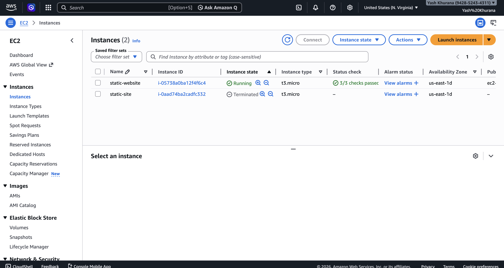
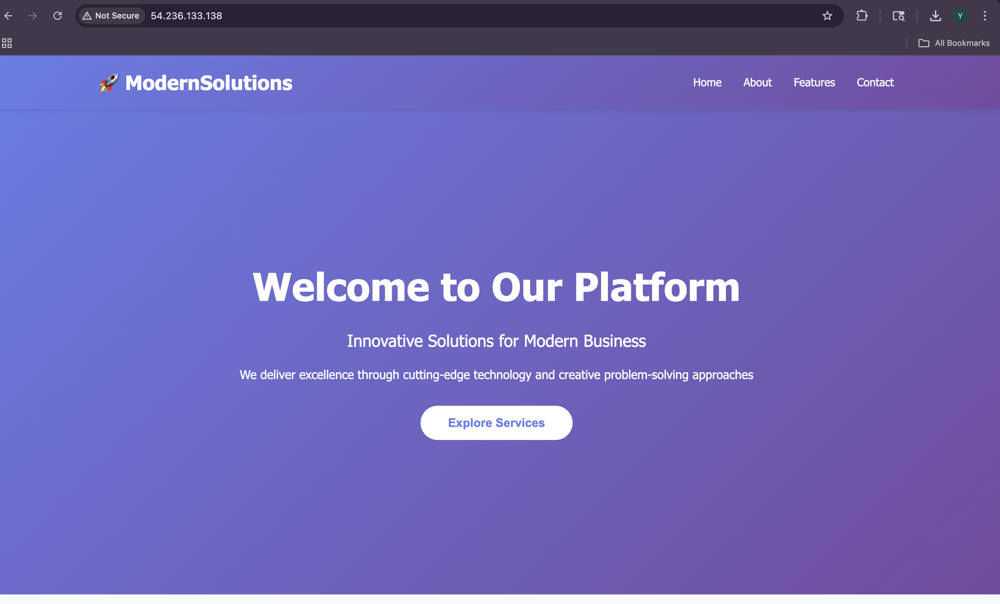
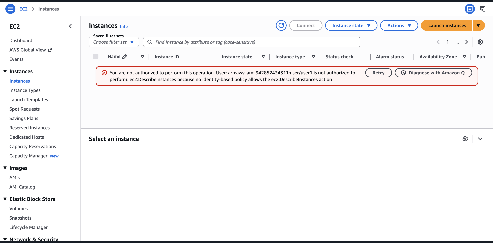

# AWS EC2 Static Website Hosting with IAM Access Control

## 👤 Student Details

* **Name:** Yash Khurana
* **Registration Number:** 12324617

## 🌐 Deployed Link

http://54.236.133.138

---

## 📌 Project Description

This project demonstrates hosting a static website on AWS EC2 and implementing IAM-based access control.

---

## ⚙️ Steps Performed

* Launched EC2 instance (Ubuntu)
* Installed Apache2 web server
* Deployed static website (HTML, CSS, JS)
* Attached Elastic IP for stable access
* Created IAM users with different permissions

---

## 👤 IAM Users

### User1

* No permissions
* Cannot access EC2

### User2

* AmazonEC2FullAccess
* Can access EC2 dashboard

---

## 📸 Screenshots

### EC2 Instance

### Website Running

### User1 Login

### User2 Login

---

## ⚠️ Challenges Faced

* SSH connection issues
* Key permission errors
* File transfer using SCP

---

## ✅ Conclusion

Successfully deployed a static website on AWS EC2 and implemented IAM access control.
